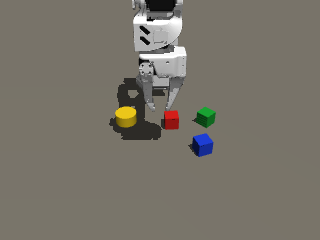
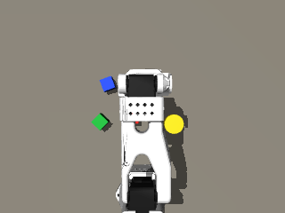
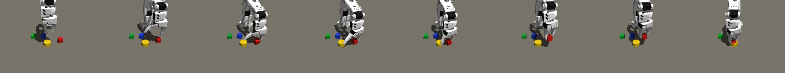

# so-arm100-sim

MuJoCo tabletop tasks, a scripted expert, domain randomisation and one
evaluation protocol for the [Standard Open Arm 100](https://github.com/TheRobotStudio/SO-ARM100),
the 5-DOF + gripper arm behind Hugging Face LeRobot. CPU only, no framework.

This repository is the shared floor under three policy projects:

| project | trains | consumes from here |
|---|---|---|
| [`so-arm100-rl`](https://github.com/AungKaung1928/so-arm100-rl) | PPO, reach → push → lift curriculum, with and without DR | `ArmEnv`, `VecEnv`, `DRConfig`, `EVAL_PHYSICS`, `evaluate` |
| [`so-arm100-il`](https://github.com/AungKaung1928/so-arm100-il) | BC → DAgger → ACT from scripted demonstrations | `ScriptedExpert`, `LeRobotRecorder`, `evaluate` |
| [`so-arm100-vla`](https://github.com/AungKaung1928/so-arm100-vla) | a language-conditioned multitask policy | all of the above plus `instructions` |

Everything a learned policy is later measured against is defined once, here:
the success criteria, the held-out physics, the seeds, the expert's own
numbers.

**Status: code complete, tests green, reference numbers not yet measured.**
Every number below marked `TODO(measure)` is produced by the named script
and will be filled in from its JSON, never typed in by hand.

<p>
 
</p>

`out/expert_filmstrip.png`: the scripted expert placing the red cube on the marker with the other two cubes as distractors.



**Walkthrough:** https://aungkaung1928.github.io/projects/so-arm100.html — the bench and the three policy projects built on it, explained end to end.

## What is in the box

```
so_arm100_sim/
  assets/trs_so_arm100/   the Menagerie arm, vendored byte-for-byte (Apache-2.0)
  scene.py                the tabletop: floor, 3 cubes, target marker, 3 cameras, ee site
  env.py                  ArmEnv: 4 tasks, 2 observation modes, 2 action modes
  dr.py                   DRConfig (training ranges) and EVAL_PHYSICS (held-out shifts)
  ik.py                   damped least-squares IK on the end-effector site
  expert.py               ScriptedExpert: IK waypoints for every task
  vec_env.py              N envs in N forked processes
  evaluate.py             the protocol: 100 episodes x 5 seeds per cell, JSON with provenance
  instructions.py         language templates with train / held-out splits
  datasets.py, record.py  LeRobotDataset v3 writer and the demo recorder (optional extra)
  render.py, gym_adapter.py
scripts/                  expert_success, bench_throughput, record_dataset, view_scene
tools/                    probe_model (measured frames), reach_map (where top-down IK works)
tests/                    63 checks; the expert's success gates are among them
```

The arm description is not edited. Everything the tasks need on top of it is
attached in Python through `mujoco.MjSpec`, and `test_scene.py` hashes the
vendored XML so an accidental edit fails CI.

## The tasks

Four tasks, one cube colour each (`red`, `green`, `blue`), optionally with the
other two cubes on the table as distractors. Control at 20 Hz over the model's
2 ms physics step.

| task | success | steps |
|---|---|---|
| `reach` | end effector within 2 cm of a point 3 cm above the cube | 100 |
| `push` | cube centre within 2.5 cm (xy) of the marker | 150 |
| `lift` | cube 5 cm above its resting height **and** both jaws touching it | 150 |
| `pick_place` | cube within 2.5 cm of the marker, on the table, released | 250 |

"Both jaws touching" is there because a cube flung upward otherwise counts
as lifted. Episodes terminate on success; `info` carries `terminated` and
`truncated` separately because a value bootstrap has to tell them apart.

Two observation layouts, chosen at construction:

- `state` (25-d, privileged): joint angles and velocities, end-effector
  position, active cube position, cube minus end effector, target position,
  jaw gap. For state-based RL.
- `proprio` (15-d): joint angles and velocities, end-effector position. What
  the real arm knows about itself. Objects come from the image. For image
  policies.

Two action conventions, both 6-d: `delta` in [-1, 1] added to the previous
joint target (a zero action holds still), or `absolute` joint targets in
radians, which is what a recorded dataset stores and what the real arm takes.

## Domain randomisation and the held-out physics

`DRConfig` is what a training run samples at every reset. `EVAL_PHYSICS` is
a fixed set of shifts a trained policy is evaluated on, and every one of
them is **outside** the DR range in at least one factor -- `test_dr.py`
asserts it. That is what makes a success rate under `EVAL_PHYSICS` a transfer
claim and not an interpolation claim.

| factor | DR range (x nominal) | held-out cell |
|---|---|---|
| cube mass | 0.5 – 2.0 | `heavy` 3.0 |
| cube sliding friction | 0.5 – 1.5 | `slippery` 0.3 |
| servo gain kp | 0.6 – 1.4 | `weak` 0.45 |
| joint damping / frictionloss | 0.5 – 2.0 | -- |
| cube half-extent | 10 – 15 mm | `small` 9 mm |
| action latency | 0 – 2 steps | `laggy` 3 |
| observation noise (rad, m) | 0.005, 0.003 | `noisy` 3x |

`kp` scales the position actuator's gain and position bias together and
leaves the velocity bias alone, so a weaker motor is also a more damped one,
which is what a weaker motor does.

## The scripted expert

IK waypoints per task, rate limited to 0.05 rad per step so the actions are
smooth enough to learn from. It reads the cube's true pose from the
simulator -- that is the privileged information a learned policy has to
recover from the image, and it is why the expert is a demonstrator and a
reference, not a controller a real robot would run.

Two things it had to do that a first draft did not:

- **Resolve the 180-degree grasp ambiguity.** A parallel jaw closing along
  yaw θ is the same grasp as θ + π, but only one branch may be inside the
  wrist-roll limit from where the arm is. Both are solved, the better one
  wins, and the branch is held for the episode so the wrist does not flip
  mid-approach.
- **Close the loop on the end effector.** The position actuators are plain
  PD with no gravity compensation; the arm settles 1–2 cm from the pose IK
  asked for, more under a weakened `kp`. The expert integrates the Cartesian
  error near the waypoint and shifts its IK target by it, with anti-windup.
  Without this the descending open jaw landed on the cube and pushed it away
  instead of straddling it.

One defect the tests caught before any policy did: the action-latency
buffer held one entry too many, so every command reached the servos a step
late even at zero latency. `test_kp_affects_tracking` failed because a step
command produced no motion inside the step that issued it. The expert had
been succeeding through it.

Where a top-down grasp is reachable at all is narrower than where the
fingertip can go (`tools/reach_map.py`), and that map, not the arm's reach,
is what set the spawn box and the lift height.

### Expert success, 100 episodes x 5 seeds per cell

`python scripts/expert_success.py` → `runs/expert_success.json`

| task | nominal | heavy | slippery | weak | laggy | noisy | small |
|---|---|---|---|---|---|---|---|
| reach | TODO(measure) | | | | | | |
| push | TODO(measure) | | | | | | |
| lift | TODO(measure) | | | | | | |
| pick_place | TODO(measure) | | | | | | |

Development readings, 30 episodes and one seed, are what the test gates in
`tests/test_expert.py` were set from and are **not** the reference: reach
1.00 everywhere; lift 0.93 nominal / 0.87 small / 0.97 weak / 0.93 heavy;
push 0.83 / 0.80 / 0.77 / 0.80; pick_place 0.93 / 0.80 / 0.93 / 0.90. The
gates sit below those. The table above replaces them when it is measured.

## Throughput

`nice -n 10 python scripts/bench_throughput.py` → `runs/throughput.json`

One env step = 25 physics steps + `mj_forward` + observation and reward.
Bare `mj_step` on this model measured 18 µs single-process during
development, i.e. about 2,200 env-steps/s per process before any Python
overhead; the sweep below is the number to budget from.

| processes | env-steps/s | efficiency |
|---|---|---|
| 1 | TODO(measure) | 100% |
| 2 | TODO(measure) | |
| 4 | TODO(measure) | |
| 8 | TODO(measure) | |

The sweep brackets every row with a single-process reference and marks the
JSON `stable: false` if the reference drifts more than 10% or trends
monotonically; a table from an unstable sweep is not quoted.

## Reproducing

```
python3 -m venv .venv && . .venv/bin/activate
pip install -e ".[dev]"            # mujoco + numpy + pytest
./verify.sh                        # tests, camera PNGs, and the two measurement commands
```

Optional extras: `.[lerobot]` for the dataset writer (Python ≥ 3.12),
`.[gym]` for the gymnasium adapter, `.[image]` for PNG output from the
scripts. Rendering needs a GL context: `MUJOCO_GL=glfw` with a display, or
`egl` / `osmesa` headless. Tests that render skip cleanly without one.

```
docker build -t so-arm100-sim . && docker run --rm so-arm100-sim
```

Image built on 2026-09-23 and its default command passed inside it (59 tests passed, 4 skipped), image size 423 MB.

## Recording demonstrations

```
python -m so_arm100_sim.record --root data/lift_red --repo-id local/so_arm100_lift_red \
    --tasks lift:red --episodes 50 --cameras front
```

Only successful expert episodes are kept. Each frame stores the 15-d proprio
state, one 96x128 image per camera, the expert's absolute joint targets as
the action, and an instruction sampled from the **training** templates in
`instructions.py`. The held-out paraphrases and the held-out (task, colour)
combinations are never written, so "unseen" means unseen.

## Limits, stated

- Simulation only. No number here is a claim about the physical SO-ARM100.
- Fixed cameras only; no wrist camera yet.
- The expert is IK-scripted and fails in ways a human demonstrator would not
  (it re-aims a push but cannot recover a cube that has yawed off the line).
- `kp` randomisation changes the damping ratio as a side effect; that is a
  choice, documented above, not an oversight.
- Rendering on the development machine is software GL at roughly 20 ms per
  96x128 frame, which bounds image-based data collection, not the physics.

## Licence

MIT for the code in this repository. The robot description under
`so_arm100_sim/assets/trs_so_arm100/` is from
[MuJoCo Menagerie](https://github.com/google-deepmind/mujoco_menagerie),
Apache-2.0, commit `822c2d8`, unchanged.
